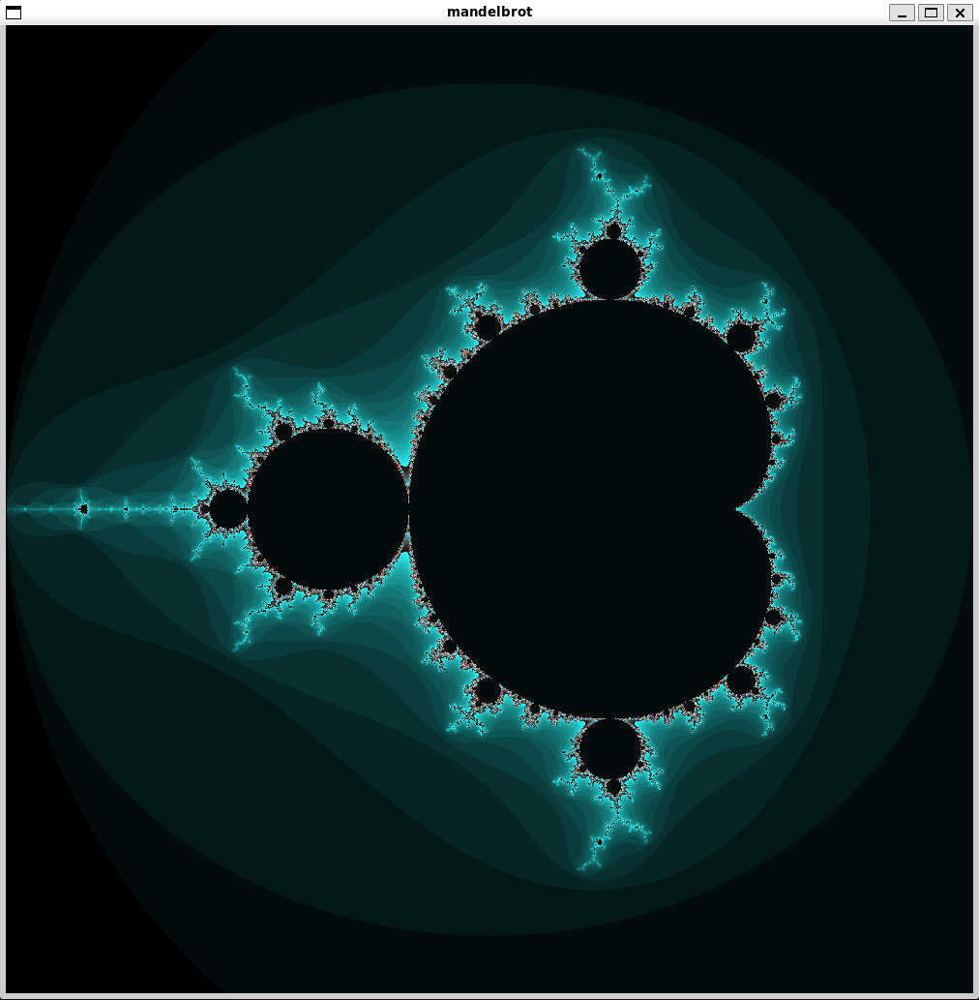
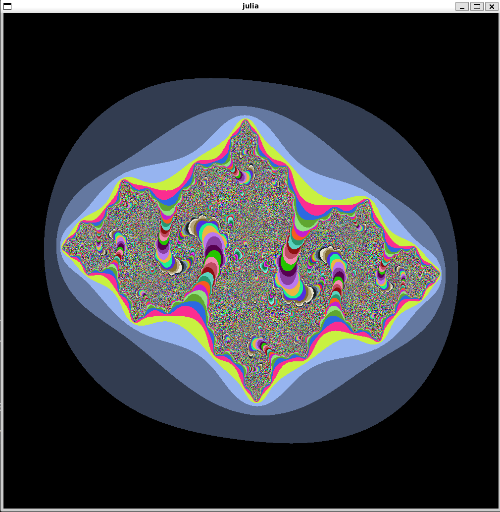
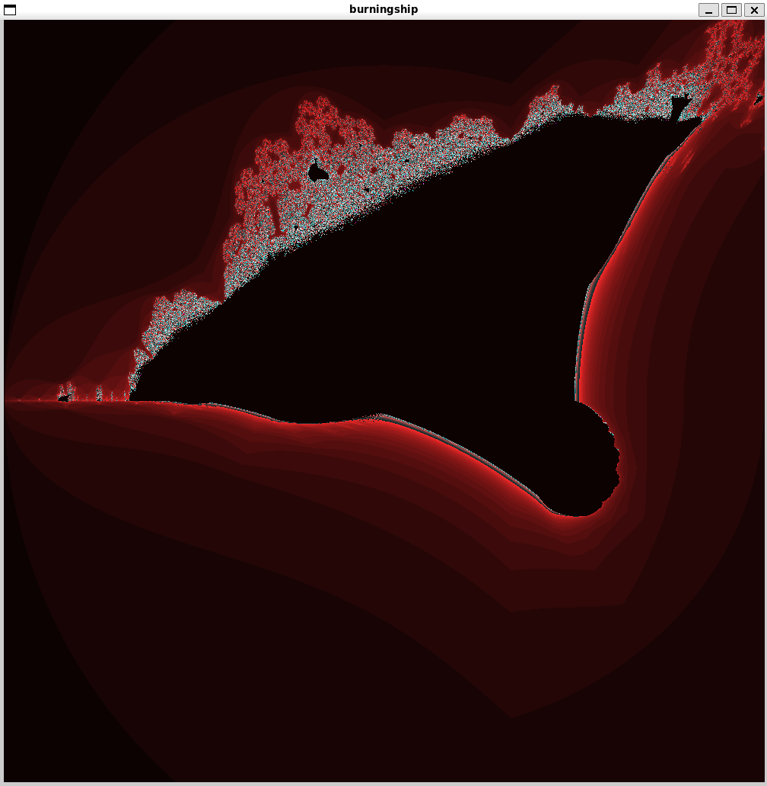

# Fractol Project with MiniLibX Library

This repository contains a fractal visualization project implemented using the MiniLibX library. The goal of this project is to create an interactive program that allows users to explore various types of fractals in real-time.

## Table of Contents

- [Introduction](#introduction)
  - [Preview](#preview)
- [Features](#features)
- [Getting Started](#getting-started)
  - [Prerequisites](#prerequisites)
  - [Installation](#installation)
- [Controls](#controls)
- [Fractal Types](#fractal-types)
- [License](#license)

## Introduction

Fractals are intricate geometric shapes that exhibit self-similarity and repeating patterns at different scales. This project aims to provide an interactive platform for visualizing various fractals, allowing users to zoom in, zoom out, and navigate around the fractal to observe its complex details.

The program is built using the MiniLibX library, which provides a basic set of graphical functions to interact with the X Window System. This makes it possible to create graphical interfaces, handle user input, and display images directly on the screen.

### Preview

{ width=600px height=600px }
{ width=600px height=600px }
{ width=600px height=600px }

## Features

- Real-time rendering of multiple types of fractals.
- Zoom in and out functionality to explore fractals in detail.
- Pan the view to navigate around the fractal.
- Color schemes to enhance visualization.
- Interactive controls for user-friendly navigation.

## Getting Started

### Prerequisites

To build and run this project, you will need:

- A UNIX-like operating system.
- `gcc` or any compatible C compiler.
- The MiniLibX library. You can find it [here](https://github.com/42Paris/minilibx-linux).
- X11 development libraries.

### Installation

1. Clone the repository: `git clone https://github.com/armanmartirosyan/fractol`
2. Build the project using the provided Makefile: `make`
3. Run the game executable: `./fractol` and fractol name (Mandelbrot, Julia, Burnunship)

## Controls

- **Zoom In**: Scroll up or press the `+` key.
- **Zoom Out**: Scroll down or press the `-` key.
- **Change Color Scheme**:
  - Increase Red: Press the `r` key.
  - Increase Green: Press the `g` key.
  - Increase Blue: Press the `b` key.
- **Move Fractol**:
  - Move Left: Press the left arrow key.
  - Move Right: Press the right arrow key.
  - Move Up: Press the up arrow key.
  - Move Down: Press the down arrow key.
- **Zoom to Mouse Directions**:
  - Scroll Up: Zoom in towards the mouse pointer.
  - Scroll Down: Zoom out away from the mouse pointer.
- **Exit Program**: Press the `ESC` key or close the window.

### Fractal Types

- **The Mandelbrot** set is a two-dimensional set with a relatively simple definition that exhibits great complexity, especially as it is magnified
- **The Julia** set and **The Fatou** set are two complementary sets (Julia "laces" and Fatou "dusts") defined from a function. Informally, the Fatou set of the function consists of values with the property that all nearby values behave similarly under repeated iteration of the function, and the Julia set consists of values such that an arbitrarily small perturbation can cause drastic changes in the sequence of iterated function values.
- **The Burning Ship** fractal, first described and created by Michael Michelitsch and Otto E. Rössler in 1992. The difference between this calculation and that for the Mandelbrot set is that the real and imaginary components are set to their respective absolute values before squaring at each iteration.

## License

This project is licensed under the [MIT License](LICENSE).
